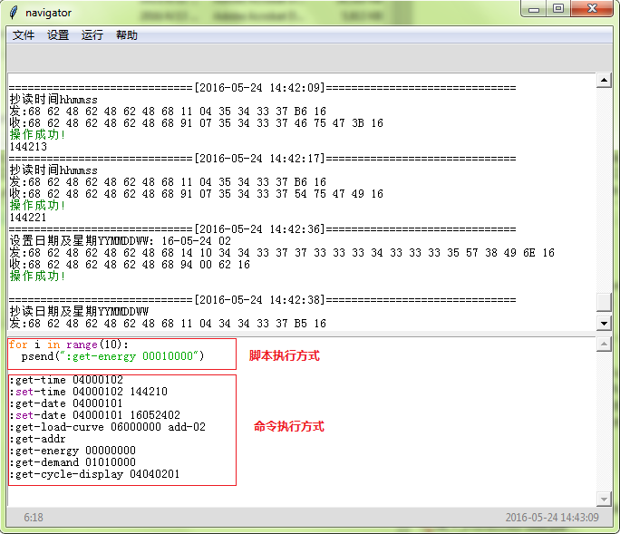

# 1.简介
navigator是一款轻量级的开源电能表自动化测试工具，该工具通信协议完全按照dl645-2007协议开发。该工具基于python3.4版本开发，使用了第三方串口通信模块pyserial。  
（ps：取名为navigator的原因是因为开发工具的界面和命令封装形式借鉴了华为工作期间使用的 一款同名自动化测试工具）

# 2.功能介绍及界面
* **主要功能**：
该工具用于电能表的自动化测试，包含了电能表的参数设置、抄读，另外还支持三晖测试台体的控制功能。主要工作模式有两种：
 1. 命令行方式：直接以封装命令形式执行，如 :get-time 为抄读电能表时间命令，执行快捷键为Ctrl+Shift+B，右键菜单、主菜单也可执行.命令行方式主要用于单个命令的抄读、设参，台体的单独控制等。
 2. 脚本方式：  以python脚本方式执行，封装命令脚本执行格式为psend("封装命令")，如   
          for i in range(10):
            psend(":get-time")
  右键菜单、主菜单均可执行脚本方式主要用于执行编写好的测试用例。每个人都可以使用该工具建立自己的测试用例库。
* **日志记录**：
所有的测试记录都会自动保存，完全不用担心错误关键信息，随时都可以查看执行记录。
* **测试脚本的打开、保存**：
书写完成的测试脚本可以保存到硬盘中，随时可以打开调用。
* **通信参数的设置**：
支持表计通信参数、测试台体通信参数的设置。
// TODO(zx): pending
* **帮助命令**：
help all ---可以查看所有封装命令
help 封装命令 ---查看某个封装命令的详细介绍，功能、返回信息等
    

# 3.模块介绍
  **navigator**: 实现GUI界面，主要包含脚本&命令的输入区、脚本&命令的执行结果输出区域，
  分别实现命令&脚本的执行和显示，附件功能：打开&保存&另存测试脚本文件、日志文件的自动保存、
  通信参数设置等。meter模块和GUI界面的接口就是从GUI界面提取输入的命令或脚本，然后执行命令
  或脚本，命令输出的信息打印至GUI的输出结果区域。其中输出可以通过修改标准的输出接口来实现。
  因此meter模块只需要对外提供一个执行命令或脚本的接口，接收参数为GUI界面的输入命令和脚本。  

  **meter**: 表计通信协议处理  

  **lib645**: 表计通信协议封装命令库  

  **rs485**: 表计485通信接口、测试台体通信接口  

  **log**: 测试日志文件处理  

  **dut**：测试台体控制程序  

  **dutlib**: 测试台体封装命令库  

  // TODO(zx): pending
  **help**: 实现help命令，查询封装命令的使用帮助  

# 4.表计通信协议封装库的设计
>原则：设计一个dl645-2007协议库，要做到灵活可扩展，不需要修改代码就可以扩展新的通信命令，这样就要做到每个命令的模板都要通用又要兼顾各种各样的协议格式，同时还要做到对重复的协议格式进行压缩，如310中抄读电量的协议命令多达上千条，其实格式都是相同的，有很大的压缩空间。

命令格式定义：
    [:get-XXXX] [xxxxxxxx] [add-]   
      必须         可选      可选(附加数据)
    [:set-XXXX] [xxxxxxxx]
      必须      可选（有|无）
命令包含三个类型:
    1.抄读命令：以":get"进行识别
    2.校时命令: 特殊命令，仅此一个
    3.写命令：以":set"进行识别(冻结、清零等归到写命令一类)
    4.如果有附加数据，以add-进行识别

1. **解析封装命令**
 * 首先从匹配的封装命令协议模板中提取type信息：
         0- 读数据
         1- 读后续数据
         2- 写数据
         3- 读通信地址
         4- 写通信地址
         5- 广播校时
         6- 冻结命令
         7- 更改通信速率
         8- 修改密码
         9- 最大需量清零
         10- 电表清零
         11- 事件清零
         20- 原始发送帧
 * 根据不同的type信息分别去调用相应的方法，提取出生成发送帧所需的全部信息,所需的详细见[7.dl645-2007协议帧分析]()

2. 生成发送帧：根据dl645-2007帧结构生成发送帧。
3. 发送发送帧：发送发送帧到485。
4. 获取接收帧：从串口接收响应帧。
5. **解析接收帧**：
6. 显示信息:

# 5.台体控制命令封装库的设计  

# 6.程序打包
1. step1：pip install pyinstaller ---安装pyinstaller，同时会安装pypiwin32依赖程序
2. step2：cd到程序文件夹navigator下，执行pyinstaller --noconsole navigator.py noconsole表示不显示控制台窗口
3. step3：执行完毕后会生成build、dist两个文件夹以及navigator_spec文件，dist文件夹下的navigator文件夹即可作为发布程序，可以直接执行其中的exe文件，不依赖python环境。  

# 7.dl645-2007协议帧分析
1. **读数据**
  主站请求帧:  
    帧格式1: m=0  **(通信地址、数据标识)**
    |68H|A0|A1|A2|A3|A4|A5|68H|11H|04H|DI0|DI1|DI2|DI3|CS|16H|  
    帧格式2: m=1 读给定块数的负荷记录  **(通信地址、数据标识、块数)**
    |68H|A0|A1|A2|A3|A4|A5|68H|11H|05H|DI0|DI1|DI2|DI3|N|CS|16H|  
    帧格式3: m=6 读给定时间、块数的负荷记录  **(通信地址、数据标识、给定时间、块数)**
    |68H|A0|A1|A2|A3|A4|A5|68H|11H|0AH|DI0|DI1|DI2|DI3|N|mm|hh|DD|MM|YY|CS|16H|  

  从站正常应答帧：  
    无后续帧  
    |68H|A0|A1|A2|A3|A4|A5|68H|91H|L|DI0|DI1|DI2|DI3|N1|...|Nm|CS|16H|  
    有后续帧  
    |68H|A0|A1|A2|A3|A4|A5|68H|B1H|L|DI0|DI1|DI2|DI3|N1|...|Nm|CS|16H|
    注:如果没有满足条件的负荷记录,从站按正常应答帧格式返回(数据域只有数据标识,数据域长度为4)
    从站异常应答帧:
    |68H|A0|A1|A2|A3|A4|A5|68H|D1H|01H|ERR|CS|16H|  

2. **读后续数据**  
  主站请求帧: **(通信地址、数据标识、SEQ)**
  |68H|A0|A1|A2|A3|A4|A5|68H|11H|05H|DI0|DI1|DI2|DI3|SEQ|CS|16H|
  从站正常应答帧：
  无后续帧
  |68H|A0|A1|A2|A3|A4|A5|68H|92H|L|DI0|DI1|DI2|DI3|N1|...|Nm|SEQ|CS|16H|
  有后续帧
  |68H|A0|A1|A2|A3|A4|A5|68H|B2H|L|DI0|DI1|DI2|DI3|N1|...|Nm|SEQ|CS|16H|
  注： 读后续数据时，为防止误传、漏传,请求帧、应答帧都要加帧序号。
  请求帧的帧序号从1开始进行加一计数，应答帧的帧序号要与请求帧相同。
  帧序号占用一个字节，计数范围为1～255。
  从站异常应答帧:
  |68H|A0|A1|A2|A3|A4|A5|68H|D2H|01H|ERR|CS|16H|

3. **写数据**
  主站请求帧: **(通信地址、数据标识、密码、操作者代码、设置的数据)**
  |68H|A0|A1|A2|A3|A4|A5|68H|14H|L|DI0|DI1|DI2|DI3|PA|P0|P1|P2|C0|C1|C2|C3|N1|...|Nm|CS|16H|
  从站正常应答帧：
  |68H|A0|A1|A2|A3|A4|A5|68H|94H|00H|CS|16H|
  从站异常应答帧:
  |68H|A0|A1|A2|A3|A4|A5|68H|D4H|01H|ERR|CS|16H|

4. **读通信地址**
  主站请求帧: **(无)**
  |68H|AAH|AAH|AAH|AAH|AAH|AAH|68H|13H|00H|CS|16H|
  从站正常应答帧：
  |68H|A0|A1|A2|A3|A4|A5|68H|93H|06H|A0|A1|A2|A3|A4|A5|CS|16H|
  从站异常不应答

5. **写通信地址**
  主站请求帧: **(设置的通信地址)**
  |68H|AAH|AAH|AAH|AAH|AAH|AAH|68H|15H|06H|A0|A1|A2|A3|A4|A5|CS|16H|
  从站正常应答帧：
  |68H|A0|A1|A2|A3|A4|A5|68H|95H|00H|CS|16H|
  从站异常不应答

6. **广播校时**
  主站请求帧: **(时间和日期)**
  |68H|99H|99H|99H|99H|99H|99H|68H|08H|06H|ss|mm|hh|DD|MM|YY|CS|16H|
  注 1：广播校时不要求应答。

7. **冻结命令**
  主站请求帧:
  普通冻结命令 **(通信地址、月日时分)**
  |68H|A0|A1|A2|A3|A4|A5|68H|16H|04H|mm|hh|DD|MM|CS|16H|
  广播冻结命令 **(月日时分)**
  |68H|99H|99H|99H|99H|99H|99H|68H|16H|04H|mm|hh|DD|MM|CS|16H|
  注 1：广播冻结不要求应答。
  从站正常应答帧：
  |68H|A0|A1|A2|A3|A4|A5|68H|96H|00H|CS|16H|
  从站异常应答帧:
  |68H|A0|A1|A2|A3|A4|A5|68H|D6H|01H|ERR|CS|16H|

8. **更改通信速率**
  主站请求帧: **(通信地址、Z)**
  |68H|A0|A1|A2|A3|A4|A5|68H|17H|01H|Z|CS|16H|
  从站正常应答帧：
  |68H|A0|A1|A2|A3|A4|A5|68H|97H|01H|Z|CS|16H|
  注： 正常应答帧中的Z与请求帧中的通信速率特征字必须相同。
  从站异常应答帧:
  |68H|A0|A1|A2|A3|A4|A5|68H|D7H|01H|ERR|CS|16H|

9. **修改密码**
  主站请求帧: **(通信地址、数据标识、原密码及权限、新密码及权限、)**
  |68H|A0|A1|A2|A3|A4|A5|68H|18H|0CH|DI0|DI1|DI2|DI3|PA0|P00|P10|P20|PAn|P0n|P1n|P2n|CS|16H|
  注 1：P00P10P20 为原密码或更高权限的密码，PA0 表示该密码权限。P0NP1NP2N 为新密码或
  需设置的密码，PAN为新密码的权限。PA0、PAN 的取值范围为 00～09，00 为最高权限，数值
  越大权限越低。权限级别分为：02 级电表清零、事件清零；04 级写数据、最大需量清零。
  从站正常应答帧：
  |68H|A0|A1|A2|A3|A4|A5|68H|98H|04H|PAn|P0n|P1n|P2n|CS|16H|
  从站异常应答帧:
  |68H|A0|A1|A2|A3|A4|A5|68H|D8H|01H|ERR|CS|16H|

10. **最大需量清零**
  主站请求帧: **(通信地址、密码、操作者代码)**
  |68H|A0|A1|A2|A3|A4|A5|68H|19H|08H|PA|P0|P1|P2|C0|C1|C2|C3|CS|16H|
  从站正常应答帧：
  |68H|A0|A1|A2|A3|A4|A5|68H|99H|00H|CS|16H|
  从站异常应答帧:
  |68H|A0|A1|A2|A3|A4|A5|68H|D9H|01H|ERR|CS|16H|

11. **电表清零**
  主站请求帧: **(通信地址、密码、操作者代码)**
  |68H|A0|A1|A2|A3|A4|A5|68H|1AH|08H|PA|P0|P1|P2|C0|C1|C2|C3|CS|16H|
  从站正常应答帧：
  |68H|A0|A1|A2|A3|A4|A5|68H|9AH|00H|CS|16H|
  从站异常应答帧:
  |68H|A0|A1|A2|A3|A4|A5|68H|DAH|01H|ERR|CS|16H|

12. **事件清零**
  主站请求帧:
  事件总清零 **(通信地址、密码、操作者代码、FFFFFFFF)**
  |68H|A0|A1|A2|A3|A4|A5|68H|1BH|0CH|PA|P0|P1|P2|C0|C1|C2|C3|FFH|FFH|FFH|FFH|CS|16H|
  分项事件清零 **(通信地址、密码、操作者代码、清零参数)**
  |68H|A0|A1|A2|A3|A4|A5|68H|1BH|0CH|PA|P0|P1|P2|C0|C1|C2|C3|FFH|DI1|DI2|DI3|CS|16H|
  从站正常应答帧：
  |68H|A0|A1|A2|A3|A4|A5|68H|9BH|00H|CS|16H|
  从站异常应答帧:
  |68H|A0|A1|A2|A3|A4|A5|68H|DBH|01H|ERR|CS|16H|
